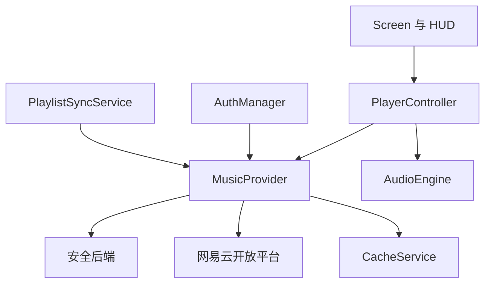
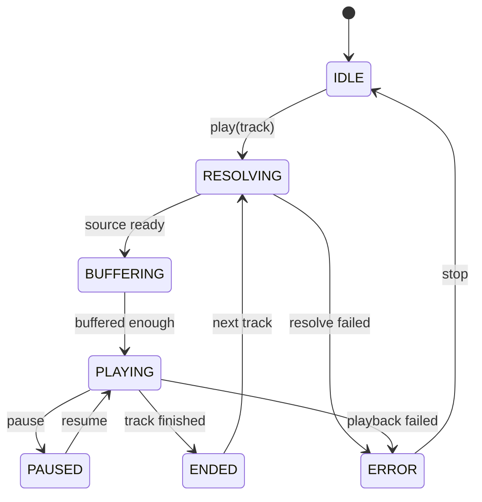

# Cubic Cadence（方律）技术设计文档

> 文档版本：v1.0.0
> 文档状态：技术设计基线，覆盖全局架构并细化第一阶段基础框架
> 创建时间：2026-08-19
> 项目名称：Cubic Cadence（方律）
> 首期音乐平台：网易云音乐

## 1. 设计目标与范围

本文档是 Minecraft Fabric 客户端音乐 Mod「Cubic Cadence（方律）」的技术设计基线，用于把已有的开发文档与接口需求文档转化为可编码的落地契约。

本文档当前重点覆盖「第一阶段：Fabric 项目骨架」，把包结构、领域模型、接口契约、模块职责、线程规则和 UI 素材方案明确到可直接照着编码的粒度；全局架构和后续阶段只给出分层与边界，不在此展开完整业务实现。

## 2. 技术栈与版本基线

| 项 | 值 | 状态 |
| --- | --- | --- |
| Minecraft | 26.2 | 已确定 |
| Fabric Loader | 0.19.3 | 已确定 |
| Fabric API | 0.158.0+26.2 | 已确定 |
| Fabric Loom | 1.17-SNAPSHOT | 已确定 |
| Java | JDK 25 | 已确定 |
| Mappings | Loom 默认 Yarn | 已确定 |
| Gradle | 9.7.0 | 已确定 |
| Mod ID | `cubic-cadence` | 已确定 |
| Java 包根 | `com.cubiccadence` | 已确定 |
| 显示名 | Cubic Cadence（方律） | 已确定 |
| 首期操作系统 | Windows | 已确定 |

## 3. 总体架构



### 3.1 分层职责

- `Screen / HUD`：只负责渲染与用户交互，不直接发起网络请求。
- `PlayerController`：维护播放队列、当前歌曲和播放状态，编排 Provider 与 AudioEngine。
- `AuthManager`：维护登录状态与令牌生命周期。
- `MusicProvider`：把不同平台数据转换为统一领域模型，隔离网易云专用 DTO。
- `PlaylistSyncService`：缓存优先的歌单同步。
- `AudioEngine`：网络音频读取、解码、缓冲与 OpenAL 输出。
- `安全后端`：公开发布时保存开发者 Private Key，处理服务端签名与令牌交换。
- `本地缓存`：保存非敏感配置、缓存元数据和令牌安全引用。

### 3.2 与开发文档的差异说明

开发文档 v0.1.0 第 11 节把整棵包结构放在 `src/client/java` 下。本文档采用已确认的「split source set + 纯客户端」结构，因此做如下调整：

- `src/main/java/com/cubiccadence/` 承载纯数据模型、Provider 接口和跨层契约，供客户端与服务端边界复用；
- `src/client/java/com/cubiccadence/client/` 承载所有客户端实现；
- `fabric.mod.json` 的 `environment` 为 `client`，仅保留 `client` 入口，移除 `main` 入口与示例 Mixin。

## 4. 命名规范与包结构

```text
src/main/java/com/cubiccadence/
├── model/
│   ├── UserProfile.java
│   ├── Artist.java
│   ├── Track.java
│   ├── PlaylistSummary.java
│   ├── PlaybackSource.java
│   ├── Availability.java
│   ├── PlaybackState.java
│   ├── PlaybackMode.java
│   ├── PlaylistOwnership.java
│   └── MusicErrorCode.java
├── provider/
│   ├── MusicProvider.java
│   ├── PageRequest.java
│   ├── SearchType.java
│   ├── AudioQuality.java
│   ├── SearchPage.java
│   └── PlaylistPage.java
└── auth/
    ├── AuthSession.java
    └── AuthState.java

src/client/java/com/cubiccadence/client/
├── CubicCadenceClient.java
├── config/
│   └── ModConfig.java
├── auth/
│   ├── AuthManager.java
│   └── SecureTokenStore.java
├── provider/
│   └── netease/
│       ├── NeteaseMusicProvider.java
│       ├── NeteaseApiClient.java
│       ├── NeteaseAuthClient.java
│       ├── dto/
│       └── mapper/
├── playback/
│   ├── PlayerController.java
│   ├── AudioEngine.java
│   ├── AudioDecoder.java
│   └── PlaybackQueue.java
├── sync/
│   └── PlaylistSyncService.java
├── cache/
│   ├── CacheService.java
│   └── CoverCache.java
├── ui/
│   ├── screen/
│   │   └── MusicLibraryScreen.java
│   ├── widget/
│   └── hud/
└── event/
```

命名约定：

- mod id 为 `cubic-cadence`（含连字符，仅用于资源命名空间）；
- Java 包名使用 `com.cubiccadence`（去掉连字符）；
- 资源标识统一通过 `CubicCadenceClient.id(String path)` 生成；
- 领域模型使用 `record`，不可变；枚举使用大写蛇形命名。

## 5. UI 素材与渲染约定

### 5.1 原则

第一阶段 UI 不打包任何自定义贴图，全部引用 Minecraft 原版客户端资源，保证视觉风格与原版一致，并避免引入额外的美术资产与授权风险。

原版资源位于本机 `C:\Users\mouqiandi\.gradle\caches\fabric-loom\26.2\minecraft-client.jar` 内的 `assets/minecraft/textures/gui/`，通过原版 `Identifier` / `Sprite` / `GuiTextures` 系统直接引用，无需复制到 Mod 的 `assets/` 目录。

### 5.2 已核实可用的素材

| 用途 | 原版资源路径 |
| --- | --- |
| 音符图标（音乐入口/品牌标识） | `sprites/icon/music_notes.png` |
| 搜索图标 | `sprites/icon/search.png` |
| 通用按钮 | `sprites/widget/button.png`（含 `_highlighted`、`_disabled` 变体） |
| 滑块轨道 | `sprites/widget/slider.png`（含 `_highlighted` 变体） |
| 滑块手柄 | `sprites/widget/slider_handle.png`（含 `_highlighted` 变体） |
| 滚动条 | `sprites/widget/scroller.png` + `scroller_background.png` |
| 输入框 | `sprites/widget/text_field.png`（含 `_highlighted` 变体） |
| 标签页 | `sprites/widget/tab.png`（含 `_selected`、`_highlighted` 变体） |
| 翻页按钮 | `sprites/widget/page_forward.png` / `page_backward.png` |
| 关闭按钮 | `sprites/widget/cross_button.png` |
| 面板背景 | `menu_background.png` / `menu_list_background.png` |
| 容器背景 | `container/generic_54.png` |
| 分隔线 | `header_separator.png` / `footer_separator.png` |

### 5.3 引用方式

上述纹理在 26.2 中通过 `Identifier.ofVanilla("widget/button")` 之类的原版标识访问，配合 `DrawContext` 的 GUI 纹理绘制方法渲染。由于 Minecraft 26.2 与当前稳定版存在 API 差异，具体绘制方法名与 `Sprite` / `GuiTextures` 类型在编码阶段以 Loom 反编译源码为准，本文档只固化「资源路径」与「绘制意图」，不预绑定可能变动的内部 API 名称。

### 5.4 布局要求

- 音乐主界面使用原版菜单背景，顶部标题、底部按钮，中部分列表区域；
- 列表滚动复用原版滚动条 sprite；
- 音量调节使用原版滑块；
- 搜索框使用原版输入框 sprite 与 `search` 图标；
- 入口图标优先使用 `music_notes.png`，保持原版观感。

### 5.5 阶段 2 音频共存与音量控制

阶段 2 的本地测试音频复用 Minecraft 现有的 `SoundManager -> SoundEngine -> SoundBuffer -> OpenAL` 输出链，不创建第二套 OpenAL 设备或上下文，也不写入、替换或停止 `MusicManager.currentMusic`。因此方律音乐是独立声音实例，能够与原版背景音乐、环境音和游戏音效并行播放。

方律音乐实例使用 `SoundSource.MASTER`，但只读取该分类对应的主音量乘数；Mod 自身音量由方律滑块控制。原版背景音乐仍使用 `SoundSource.MUSIC`。最终关系为：

| 输出 | 最终音量 |
| --- | --- |
| 原版背景音乐 | Minecraft 主音量 × 原版音乐音量 × 原版环境淡入淡出系数 |
| 方律音乐 | Minecraft 主音量 × 方律音量 |
| 其他游戏声音 | Minecraft 主音量 × 对应声音分类音量 |

音乐主界面同时提供以下控制：

- “禁用原版背景音乐”复选框：将原版 `MUSIC` 选项设为 0，但不停止 `MusicManager`，取消勾选时恢复最近一次非零音量；
- “原版音乐音量”滑块：直接绑定 Minecraft 原生 `OptionInstance<Double>`，即时刷新原版声音引擎；
- “方律音量”滑块：只调整当前及后续方律音乐实例，不修改任何原版分类；
- 原版音乐滑块拖到 0 时复选框同步勾选；取消复选框时恢复此前的非零值。

阶段 2 采用合法的短音频文件（WAV/MP3）和整段 PCM 静态缓冲，只用于隔离验证解码、输出和生命周期。`JavaSoundAudioDecoder` 按文件魔数识别格式，WAV 走 JDK 内置读取器，MP3 通过 JavaSound SPI provider 显式解码，统一归一化为 16-bit 小端 PCM。音乐界面直接复用原版 HUD 的 `experience_bar_background` 与 `experience_bar_progress` sprite，将条体加长到与音量控件一致的 220 像素，以灰色槽和绿色填充展示进度，并叠加带深色描边的像素拖动点；纯时间数值显示在经验条正下方居中。播放/暂停切换和停止使用紧凑媒体图标按钮，并通过 Tooltip 保留当前操作的本地化文字说明，本地测试入口增加 WAV/MP3 格式切换按钮。播放中或暂停中拖动时只更新条体、拖动点和目标时间预览，不连续修改声音位置；释放鼠标后才通过当前静态 OpenAL 声源的 `AL_SEC_OFFSET` 执行一次 seek，并同步内部播放时钟，避免连续重定位产生杂音。在线长音频仍必须在后续阶段改为有限大小的流式缓冲队列，并基于流式解码器单独实现 seek，不能直接沿用静态缓冲方案。

## 6. 线程模型与异步约定

### 6.1 禁止事项

- 禁止在 Screen 渲染方法中执行网络请求；
- 禁止在客户端 Tick 中阻塞等待 `Future.get()`；
- 禁止从后台线程直接修改 Minecraft GUI 对象；
- 禁止在音频回调中执行阻塞式 API 请求；
- 禁止创建无法停止的常驻后台线程。

### 6.2 约定

- HTTP 请求统一返回 `CompletableFuture`；
- 网络、解码、封面读取使用不同的受控执行器，均有数量上限；
- UI 更新切回 Minecraft 客户端线程；
- 搜索与切歌保留取消句柄；
- 连续输入搜索内容做防抖；
- 所有执行器在客户端关闭时统一停止。

## 7. 安全设计

| 凭证 | 归属 | 存放位置 |
| --- | --- | --- |
| 网易云 Cookie | 玩家 | DPAPI 加密存储，禁止日志输出 |
| 临时播放地址 | 播放期间 | 仅内存短期使用，不持久化 |

阶段 3 在 Windows 首期范围内使用 DPAPI 加密网易云 Cookie 会话，文件为 `config/cubic-cadence/auth-session.dpapi`。Mod 直连自建的 `api-enhanced` 服务，不再持有开发者 Private Key；日志统一脱敏，禁止输出 Cookie 与完整播放地址。

## 8. 错误处理与状态机

### 8.1 统一错误码

`MusicErrorCode` 枚举覆盖网络、授权、限流、播放与未知错误，作为 Provider 与上层模块之间的统一错误契约。

### 8.2 播放状态机



### 8.3 登录状态机

`AuthState` 覆盖 `SIGNED_OUT / AUTHORIZING / SIGNED_IN / REFRESHING / EXPIRED / ERROR`。

## 9. 第一阶段基础框架实现清单

本节逐类列出字段与方法签名。第一阶段只建立可编译、可运行、能打开/关闭音乐主界面的骨架，业务逻辑以 `TODO` 占位，不接入真实网易云请求。

### 9.1 领域模型（`src/main/java/com/cubiccadence/model/`）

```java
// UserProfile.java
public record UserProfile(
        String providerId,
        String userId,
        String displayName,
        String avatarUrl,
        int level,
        MembershipTier membershipTier
) {}

// Artist.java
public record Artist(
        String providerId,
        String artistId,
        String name
) {}

// Track.java
public record Track(
        String providerId,
        String trackId,
        String title,
        List<Artist> artists,
        String albumName,
        String coverUrl,
        long durationMs,
        Availability availability
) {}

// PlaylistSummary.java
public record PlaylistSummary(
        String providerId,
        String playlistId,
        String name,
        String coverUrl,
        int trackCount,
        PlaylistOwnership ownership
) {}

// PlaybackSource.java
public record PlaybackSource(
        URI uri,
        String contentType,
        long expiresAtEpochMs,
        Map<String, String> requestHeaders,
        AudioQuality quality,
        Integer bitrate
) {}

// Availability.java
public enum Availability {
    PLAYABLE,
    UNAVAILABLE,
    MEMBERSHIP_REQUIRED,
    REGION_RESTRICTED,
    QUALITY_UNAVAILABLE,
    UNKNOWN
}

// PlaybackState.java
public enum PlaybackState {
    IDLE,
    RESOLVING,
    BUFFERING,
    PLAYING,
    PAUSED,
    ENDED,
    ERROR
}

// PlaybackMode.java
public enum PlaybackMode {
    SEQUENTIAL,
    REPEAT_ONE,
    REPEAT_ALL,
    SHUFFLE
}

// PlaylistOwnership.java
public enum PlaylistOwnership {
    CREATED,
    COLLECTED,
    SPECIAL
}

public enum MembershipTier {
    UNKNOWN,
    NON_MEMBER,
    MUSIC_PACKAGE,
    BLACK_VINYL_VIP
}

// MusicErrorCode.java
public enum MusicErrorCode {
    NETWORK_UNAVAILABLE,
    AUTH_REQUIRED,
    AUTH_EXPIRED,
    RATE_LIMITED,
    TRACK_UNAVAILABLE,
    MEMBERSHIP_REQUIRED,
    REGION_RESTRICTED,
    SOURCE_EXPIRED,
    DECODER_UNSUPPORTED,
    PLAYBACK_FAILED,
    UNKNOWN
}
```

### 9.2 Provider 抽象（`src/main/java/com/cubiccadence/provider/`）

```java
// PageRequest.java
public record PageRequest(
        int page,
        int pageSize
) {}

// SearchType.java
public enum SearchType {
    TRACK,
    PLAYLIST,
    ALBUM
}

// AudioQuality.java
public enum AudioQuality {
    LOW,
    STANDARD,
    HIGH,
    LOSSLESS
}

// SearchPage.java
public record SearchPage<T>(
        List<T> items,
        boolean hasNext,
        Integer total,
        String nextCursor
) {}

// PlaylistPage.java
public record PlaylistPage(
        List<Track> tracks,
        boolean hasNext,
        String nextCursor
) {}

public record PlaylistSummaryPage(
        List<PlaylistSummary> items,
        boolean hasNext,
        Integer total
) {}

// MusicProvider.java
public interface MusicProvider {
    String id();

    CompletableFuture<AuthSession> beginLogin();

    CompletableFuture<AuthSession> pollAuthorization(String authorizationId);

    CompletableFuture<AuthSession> refresh(AuthSession session);

    CompletableFuture<UserProfile> getCurrentUser(AuthSession session);

    CompletableFuture<PlaylistSummaryPage> getUserPlaylists(
            AuthSession session,
            String userId,
            PageRequest pageRequest
    );

    CompletableFuture<PlaylistPage> getPlaylistTracks(
            AuthSession session,
            String playlistId,
            PageRequest pageRequest
    );

    CompletableFuture<SearchPage<?>> search(
            String keyword,
            SearchType type,
            PageRequest pageRequest
    );

    CompletableFuture<PlaybackSource> resolvePlaybackSource(
            String trackId,
            AudioQuality quality
    );

    CompletableFuture<Void> logout();
}
```

### 9.3 认证契约（`src/main/java/com/cubiccadence/auth/`）

```java
// AuthSession.java
public record AuthSession(
        String providerId,
        String accessToken,
        String refreshToken,
        long expiresAtEpochMs
) {}

// AuthState.java
public enum AuthState {
    SIGNED_OUT,
    AUTHORIZING,
    SIGNED_IN,
    REFRESHING,
    EXPIRED,
    ERROR
}
```

### 9.4 客户端入口（`src/client/java/com/cubiccadence/client/`）

```java
// CubicCadenceClient.java
public class CubicCadenceClient implements ClientModInitializer {
    public static final String MOD_ID = "cubic-cadence";
    public static final Logger LOGGER = LoggerFactory.getLogger(MOD_ID);

    private KeyBinding openLibraryKey;

    @Override
    public void onInitializeClient() {
        registerKeyBinding();
        registerClientTick();
        LOGGER.info("Cubic Cadence client initialized");
    }

    public static Identifier id(String path) {
        return Identifier.fromNamespaceAndPath(MOD_ID, path);
    }

    private void registerKeyBinding();

    private void registerClientTick();

    private void openMusicLibrary();
}
```

说明：`KeyBinding` 的注册与客户端 Tick 检测按键的具体 API 以 Minecraft 26.2 + Fabric API 0.158.0 的 Loom 反编译源码为准，默认快捷键为 `M`，绑定方式遵循当前版本 Fabric API 提供的注册入口。

### 9.5 配置（`src/client/java/com/cubiccadence/client/config/`）

```java
// ModConfig.java
public class ModConfig {
    private static ModConfig INSTANCE;

    private float volume = 1.0f;
    private boolean hudEnabled = true;
    private AudioQuality audioQuality = AudioQuality.STANDARD;

    public static ModConfig getInstance();

    public float getVolume();
    public void setVolume(float volume);

    public boolean isHudEnabled();
    public void setHudEnabled(boolean enabled);

    public AudioQuality getAudioQuality();
    public void setAudioQuality(AudioQuality quality);

    public void load();
    public void save();
}
```

配置序列化到 `config/cubic-cadence/config.json`，第一阶段使用 JSON 手工读写，后续再评估是否引入配置库。

### 9.6 认证模块（`src/client/java/com/cubiccadence/client/auth/`）

```java
// SecureTokenStore.java
public interface SecureTokenStore {
    void save(AuthSession session);
    Optional<AuthSession> load();
    void clear();
}

// AuthManager.java
public class AuthManager {
    private final MusicProvider provider;
    private final SecureTokenStore tokenStore;
    private volatile AuthState state = AuthState.SIGNED_OUT;

    public AuthManager(MusicProvider provider, SecureTokenStore tokenStore);

    public AuthState getState();

    public CompletableFuture<Void> beginLogin();

    public CompletableFuture<Void> pollAuthorization();

    public CompletableFuture<Void> restoreSession();

    public CompletableFuture<Void> refresh();

    public CompletableFuture<Void> logout();
}
```

阶段 3 的 `AuthManager` 已实现授权挑战、后台轮询、会话恢复、到期前单次刷新、退出清理和错误状态。由于网易云官方对个人开发者不支持多用户 API，项目已决策改用第三方逆向库 `NeteaseCloudMusicApiEnhanced/api-enhanced` 作为数据来源：客户端直连自建服务，会话改为 Cookie 模型，原 Spring Boot 后端已废弃删除；该方案非官方授权，存在合规与随时失效风险。

### 9.7 网易云 Provider（`src/client/java/com/cubiccadence/client/provider/netease/`）

```java
// NeteaseMusicProvider.java
public class NeteaseMusicProvider implements MusicProvider {
    public static final String PROVIDER_ID = "netease";

    private final NeteaseApiClient apiClient;
    private final NeteaseAuthClient authClient;

    public NeteaseMusicProvider();

    @Override
    public String id() {
        return PROVIDER_ID;
    }

    // 其余接口方法第一阶段返回 TODO 占位实现
}

// NeteaseApiClient.java
public class NeteaseApiClient {
    // TODO: 封装网易云开放平台 HTTP 调用
}

// NeteaseAuthClient.java
public class NeteaseAuthClient {
    // TODO: 封装网易云授权与令牌交换
}
```

`dto/` 与 `mapper/` 目录在第一阶段留空，后续根据官方文档建立网易云专用 DTO 与到领域模型的映射。

### 9.8 播放模块（`src/client/java/com/cubiccadence/client/playback/`）

```java
// PlaybackQueue.java
public class PlaybackQueue {
    private final List<Track> tracks = new ArrayList<>();
    private int cursor = -1;
    private PlaybackMode mode = PlaybackMode.SEQUENTIAL;

    public void setTracks(List<Track> tracks);
    public Track current();
    public Track next();
    public Track previous();
    public void setMode(PlaybackMode mode);
    public PlaybackMode getMode();
    public void clear();
}

// AudioDecoder.java
public interface AudioDecoder {
    boolean supports(String contentType);
    DecodedAudio decode(byte[] encodedBytes) throws IOException;
}

// AudioEngine.java
public class AudioEngine {
    public void start();
    public void stop();
    public void play(PlaybackSource source);
    public void pause();
    public void resume();
    public void seek(long positionMs);
    public void setVolume(float volume);
    public long getPositionMs();
    public long getDurationMs();
}

// PlayerController.java
public class PlayerController {
    private final MusicProvider provider;
    private final AudioEngine audioEngine;
    private final PlaybackQueue queue;
    private volatile PlaybackState state = PlaybackState.IDLE;
    private volatile Track currentTrack;

    public PlayerController(MusicProvider provider, AudioEngine audioEngine);

    public PlaybackState getState();
    public Track getCurrentTrack();

    public void play(Track track);
    public void pause();
    public void resume();
    public void next();
    public void previous();
    public void seekTo(long positionMs);
    public void setVolume(float volume);
    public void setPlaybackMode(PlaybackMode mode);
    public void stop();
}
```

### 9.9 同步与缓存（`src/client/java/com/cubiccadence/client/sync/`、`cache/`）

```java
// PlaylistSyncService.java
public class PlaylistSyncService {
    private final MusicProvider provider;
    private final CacheService cache;

    public PlaylistSyncService(MusicProvider provider, CacheService cache);

    public CompletableFuture<List<PlaylistSummary>> sync();

    public CompletableFuture<PlaylistPage> loadTracks(
            String playlistId,
            PageRequest pageRequest
    );
}

// CacheService.java
public class CacheService {
    public <T> void write(String key, T value);
    public <T> Optional<T> read(String key, Class<T> type);
    public void delete(String key);
    public void clear();
}

// CoverCache.java
public class CoverCache {
    public CompletableFuture<Optional<byte[]>> get(String url);
    public void evict(String url);
    public void clear();
}
```

当前歌曲详情的运行时状态由 `client/library/PlaylistDetailManager` 管理。它不参与启动同步；只有用户点击歌单后才从 `AuthManager` 读取当前会话并调用 `MusicProvider.getPlaylistTracks(session, playlistId, pageRequest)`。每页请求 50 首，当前页只保存在内存中，切换歌单、退出登录或关闭客户端时通过请求代次丢弃迟到响应。

### 9.10 UI（`src/client/java/com/cubiccadence/client/ui/screen/`）

```java
// MusicLibraryScreen.java
public class MusicLibraryScreen extends Screen {
    public MusicLibraryScreen();

    @Override
    protected void init();

    @Override
    public void render(...);

    @Override
    public boolean shouldPause();

    @Override
    public void close();
}

// MusicSettingsScreen.java
public final class MusicSettingsScreen extends Screen {
    public MusicSettingsScreen(Screen parent);
}

// PlaylistDetailScreen.java
public final class PlaylistDetailScreen extends Screen {
    public PlaylistDetailScreen(Screen parent, PlaylistSummary playlist);
}
```

当前 `MusicLibraryScreen` 在登录后展示账号头像、昵称、完整用户标识、等级和会员状态；中部为居中的 4 列 × 2 行用户歌单大封面网格，封面最大逻辑尺寸为 176×176，通过紧贴网格下方的「上一页 / 下一页」在已同步摘要中按每页 8 项本地分页。界面提供手动刷新、首次同步计数、后台刷新提示和上次同步时间，并以「我创建的歌单 / 我收藏的歌单 / 红心歌曲」标识来源。主页右下角齿轮打开 `MusicSettingsScreen`，方律音量、原版音乐音量和禁用原版背景音乐均集中在设置页。

`NeteaseApiClient` 以 `/user/account` 的身份资料为基础，通过认证会话调用 `/user/level` 与 `/vip/info` 补充等级和会员；明确无权益时显示非会员，补充接口不可用时显示未知而不回退登录状态。`MusicLibraryManager` 启动时先由 `LibraryCacheStore` 异步读取 `config/cubic-cadence/cache/library.json`，立即展示公开账号资料和全部歌单摘要，再在后台以每批最多 50 项请求 `/user/playlist` 直至完成；刷新失败保留可用缓存，显式退出删除资料库与封面缓存。缓存不含 Cookie、完整播放地址和歌曲明细，歌单歌曲仍留待点击歌单后按需加载。

`RemoteTextureCache` 在客户端后台下载网易云图片，只在渲染线程注册/释放动态纹理；网络响应优先通过 Java `ImageIO` 解码为 `BufferedImage`，再转换为 Minecraft `NativeImage`，绕开当前环境中部分合法 PNG 直接解码失败的问题。成功响应写入有数量上限的磁盘缓存，后续页面与启动可复用；网络错误采用有限重试，格式、尺寸和解码等确定性错误不做无效重试，日志仅保留主机、阶段和异常类型，图片失败仍只降级占位而不改变登录状态。

点击主页歌单卡片后进入 `PlaylistDetailScreen`。详情页使用原版 `ObjectSelectionList` 按需展示当前 50 首歌曲的封面、名称、歌手、专辑、时长和权限状态，并通过上一页/下一页继续请求。`NeteaseApiClient` 调用 `/playlist/track/all`，将 `songs` 与 `privileges` 按歌曲 ID 合并；地区提示优先映射为 `REGION_RESTRICTED`，灰色版权歌曲映射为 `COPYRIGHT_RESTRICTED`，当前账号无会员权益映射为 `MEMBERSHIP_REQUIRED`，无法可靠判断时保持 `UNKNOWN`。

点击可尝试播放的歌曲后，`PlayerController` 读取 `AuthManager` 当前会话，通过无状态 `MusicProvider.resolvePlaybackSource(session, trackId, quality)` 调用 api-enhanced `/song/url/v1`。低、标准和高音质分别请求 `standard`、`higher`、`exhigh`；不发送 `unblock`，不调用灰色歌曲或版权绕过接口。返回的临时地址只保存在内存中，Cookie 与完整媒体地址不写日志；`freeTrialInfo` 存在时记录为 `PlaybackAccess.TRIAL` 并在界面明确标注试听。

在线 MP3 使用 `JavaSoundStreamingAudioStream` 在专用后台线程执行 HTTP 读取和 JavaSound 解码，最多缓存 16 个 64 KiB PCM 块。Minecraft 原版声音线程通过自带 `AudioStream` 从有界队列消费 PCM，并继续使用游戏已有 OpenAL 设备和声道；停止、切歌、自然结束、退出登录和关闭客户端都会关闭网络流。`PlaybackQueue` 以当前详情页已加载歌曲作为队列，支持顺序、单曲循环、列表循环和带历史的随机播放，并跳过明确受版权、会员、地区或音质限制的歌曲。当前阶段不支持 FLAC 无损解码及在线任意位置 seek，且不会静默降低用户选择的无损音质。

流式读取明确区分 `RUNNING / EOF / FAILED / CANCELLED`：短时网络断流只向 OpenAL 提供当前所需的静音保活缓冲并进入 `BUFFERING`，数据恢复后继续播放；连续断流超过 10 秒、解码失败或实际 PCM 时长比播放源声明时长短超过容差时进入 `FAILED`，不得作为自然结束自动切歌。PCM 队列硬上限为 1 MiB，OpenAL 仍仅保留原版四段流缓冲，静音数据不另行积压。停止与切歌只在调用线程设置取消标记、清空队列和中断生产任务，JavaSound 与 HTTP 流由最多两个专用清理线程关闭，禁止在客户端渲染 tick 同步等待网络资源释放。

为缩短连续切歌停顿，播放器在进入 `PLAYING` 后通过 `PlaybackQueue.peekNextAfterEnd()` 以非破坏方式定位下一首，并提前解析播放源、调用 `AudioEngine.preload()` 预打开流、`LyricsManager.preload()` 预取歌词。`AudioEngine.preload()` 复用同一 `JavaSoundStreamingAudioStream.open()` 路径完成建连、解码与预缓冲；命中就绪流时 `play()` 直接挂载并跳过重复打开，失败或尚未就绪则退回实时打开。预加载仅对在线 http/https 源生效，本地音源仍走整曲解码缓存；手动切歌、队列到底、停止与退出登录会清理过期预加载，洗牌回绕重排那一拍因无法无消耗预测而回退惰性加载。

Minecraft 声道通过一段静音静态缓冲取得游戏管理的 OpenAL Source。切换到在线流时必须在声音线程依次停止 Source、将 `AL_BUFFER` 设为 0、释放静音引导缓冲、挂载 `AudioStream` 队列并重新播放；OpenAL 不允许静态 `AL_BUFFER` 与 `AL_BUFFERS_QUEUED` 同时存在。挂载后以 `AL_BUFFERS_QUEUED > 0` 作为成功条件，失败时关闭流并进入 `ERROR`，不得由声音 tick 无限重复补充无效缓冲。

### 9.11 同步歌词与平台无关 HUD

`MusicProvider.getLyrics(session, trackId)` 是跨平台歌词契约。网易云实现按当前播放歌曲调用 api-enhanced `/lyric/new`，将 `lrc.lyric` 与 `tlyric.lyric` 解析为按时间排序的 `SyncedLyrics / LyricLine`；第一版只做逐行同步，不解析 `yrc` 逐字卡拉 OK。歌词按需获取并限制在最多 64 首的内存 LRU 中，不批量抓取歌单歌词、不写磁盘、不输出歌词正文到日志。无歌词、纯音乐和歌词请求失败只让歌词区域降级，不改变播放状态。

`LyricsManager` 以 `providerId + trackId` 标识请求，切歌、停止和关闭客户端时递增请求代次，迟到响应不得覆盖当前歌曲。歌词高亮直接使用播放器时间轴进行二分查找：当前行是最后一个 `startTimeMs <= positionMs` 的条目，下一行是其后继。试听源额外保留 `PlaybackSource.timelineOffsetMs`，歌词时间为本地播放进度加试听片段在原曲中的起点，HUD 进度仍使用试听片段自身进度。

HUD 工具分为 `NowPlayingSource -> NowPlayingSnapshot -> NowPlayingHudElement`。渲染器只依赖统一 `Track`、播放状态、时间与歌词文本，不导入网易云实现；未来音乐平台只需实现 Provider 歌词能力并提供相同 Now Playing 快照即可复用。Fabric `HudElementRegistry` 将该元素挂在原版 Boss Bar 之后，跟随 F1 隐藏；正常游戏画面左上角显示半透明面板，封面位于左侧，歌名、作者和进度条位于右侧，底部同一行左侧高亮当前歌词、右侧弱化下一行。打开其他 Screen 或 F3 调试覆盖层时不显示。

`HudSettingsScreen` 提供 HUD 总开关及封面、歌名、作者、进度、歌词五个独立选项，写入 `config/cubic-cadence.json`。旧配置缺少新字段时全部默认开启。退出登录必须通过 `PlayerController.stop()` 同时清除音频、当前歌曲和 HUD 状态。

## 10. 与网易云接口的映射

| 项目模块或方法 | 对应接口能力 |
| --- | --- |
| `AuthManager.beginLogin()` | NCM-AUTH-001、NCM-AUTH-002 |
| `AuthManager.refresh()` | NCM-AUTH-003 |
| `AuthManager.restoreSession()` | NCM-AUTH-004 |
| `MusicProvider.logout()` | NCM-AUTH-005 |
| `MusicProvider.getCurrentUser()` | NCM-USER-001 |
| `MusicProvider.getUserPlaylists()` | NCM-LIB-001、NCM-LIB-002 |
| `MusicProvider.getPlaylistTracks()` | NCM-LIB-003、NCM-LIB-004、NCM-TRACK-001 |
| `MusicProvider.search()` | NCM-SEARCH-001 至 NCM-SEARCH-003 |
| `MusicProvider.resolvePlaybackSource()` | NCM-PLAY-001、NCM-PLAY-002 |
| `MusicProvider.getLyrics()` | api-enhanced `/lyric/new` |

网易云多用户 API 已因个人开发者限制而放弃官方接入，改走 `NeteaseCloudMusicApiEnhanced/api-enhanced` 逆向库；编码时以该库实际接口为准，并保留本段所述合规风险提示。

## 11. 后续阶段路线

1. 阶段 0：开放平台能力验证（授权方式、Scope、播放权益与播放源）。
2. 阶段 1：本骨架落地并验收「可启动、可打开/关闭界面」。
3. 阶段 2：本地音频播放验证（OpenAL 与解码库）。
4. 阶段 3：网易云登录与令牌生命周期（客户端直连 `api-enhanced` 服务，会话改为 Cookie 模型）。
5. 阶段 4：歌单同步与音乐库。
6. 阶段 5：在线歌曲播放、同步歌词与通用正在播放 HUD。
7. 阶段 6：稳定性与发布准备。

## 12. 参考资料

- [Minecraft Fabric 音乐体验 Mod 开发文档](./minecraft-fabric-music-mod-development-document.md)
- [网易云音乐 API 接口调用需求文档](./netease-cloud-music-api-integration-requirements.md)
- [Fabric Developer Guides](https://docs.fabricmc.net/develop/)
- [Fabric Custom Screens](https://docs.fabricmc.net/develop/rendering/gui/custom-screens)
- [网易云音乐开放平台](https://developer.music.163.com/)
- [LavaPlayer](https://github.com/lavalink-devs/lavaplayer)
