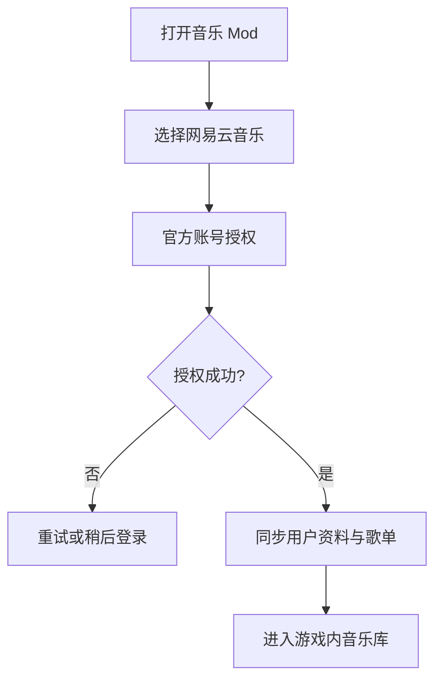
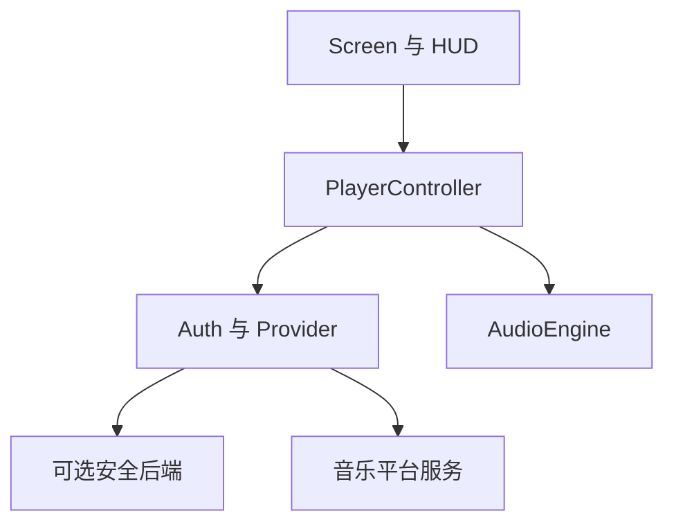

# Minecraft Fabric 音乐体验 Mod 开发文档

> 文档版本：v0.1.0  
> 文档状态：需求与技术方案初稿  
> 更新时间：2026-08-17  
> 项目名称：Cubic Cadence（方律）  
> 首期音乐平台：网易云音乐

## 1. 文档目的

本文档用于指导一个 Minecraft Java Edition Fabric 客户端 Mod 的设计与开发。该 Mod 在游戏内提供音乐平台登录、个人歌单同步、歌曲搜索与播放能力，减少玩家在 Minecraft 与外部音乐客户端之间切换的次数，并通过游戏场景联动增强游玩氛围。

本文档同时作为以下工作的基准：

- 需求确认与范围控制；
- Fabric 客户端架构设计；
- 网易云音乐开放平台接入验证；
- 登录、令牌和开发者密钥的安全设计；
- 音频播放链路的技术验证；
- 后续开发、测试和发布验收。

## 2. 项目概述

### 2.1 产品定位

本项目是一个纯客户端音乐体验 Mod。玩家安装 Mod 后，可以在 Minecraft 内登录自己的音乐平台账号，同步个人歌单并播放音乐。正常情况下，联机服务器不需要安装该 Mod，也不参与用户登录、歌单同步和音频传输。

### 2.2 首期目标

第一期优先接入网易云音乐，完成以下闭环：

1. 玩家首次打开 Mod；
2. 使用网易云官方支持的方式完成账号授权；
3. 加载用户资料、创建的歌单、收藏歌单和红心歌曲；
4. 在游戏内浏览歌单和搜索歌曲；
5. 播放、暂停、切歌、拖动进度和调节音量；
6. 再次启动游戏时恢复登录状态，并以缓存优先的方式刷新歌单。

### 2.3 长期方向

- 接入更多具有正式开放能力的国内音乐平台；
- 支持歌词、桌面歌词式 HUD 和封面动画；
- 根据维度、群系、天气、昼夜和战斗状态切换音乐；
- 提供跨平台统一的 `MusicProvider` 扩展体系；
- 在符合平台规则的前提下发布到 Modrinth、CurseForge 等平台。

## 3. 已确认的产品决策

| 决策项 | 当前结论 |
| --- | --- |
| Mod 类型 | 纯客户端 Fabric Mod |
| 首期平台 | 网易云音乐 |
| 登录方式 | 官方二维码、浏览器授权或开放平台实际提供的授权方式 |
| 是否收集密码 | 否，Mod 不提供音乐平台账号密码输入框 |
| 歌单策略 | 缓存优先、后台刷新、按需加载歌曲列表 |
| 音频策略 | 播放时临时解析音源，不永久缓存完整歌曲 |
| 平台扩展 | 使用统一 Provider 接口隔离不同平台 |
| 密钥策略 | 开发者 Private Key 不进入客户端 JAR 和公开仓库 |
| 公开发布 | 原则上需要后端保存开发者密钥并承担安全交换职责 |

## 4. 项目范围

### 4.1 MVP 必须实现

#### 首次使用与登录

- 首次打开时展示欢迎页；
- 展示可用音乐平台，第一期只启用网易云音乐；
- 发起官方账号授权；
- 展示授权等待、成功、失败和超时状态；
- 登录成功后获取用户头像、昵称和用户标识；
- 支持退出登录并清除本地授权数据。

#### 音乐库同步

- 同步用户创建的歌单；
- 同步用户收藏的歌单；
- 同步红心歌曲或平台提供的等价收藏集合；
- 支持手动刷新；
- 首次进入时显示同步进度；
- 后续启动先读取缓存，再在后台刷新；
- 点击歌单后再加载具体歌曲，避免启动时请求全部内容。

#### 搜索和播放

- 搜索歌曲、歌单和专辑；
- 展示歌曲名称、歌手、专辑、时长和封面；
- 播放、暂停、继续、上一首和下一首；
- 展示当前进度和总时长；
- 支持进度跳转；
- 支持音量调节；
- 支持顺序播放、单曲循环、列表循环和随机播放；
- 展示不可播放、版权受限、会员不足或地区受限状态；
- 不尝试绕过平台返回的播放限制。

#### 基础游戏内界面

- 注册可自定义快捷键，默认建议使用 `M`；
- 提供音乐库主界面；
- 提供歌单详情界面；
- 提供搜索界面；
- 提供底部或侧边迷你播放器；
- 提供简洁的正在播放 HUD，并允许关闭；
- 在 Minecraft GUI 缩放变化后保持可用布局。

#### 稳定性

- 网络请求不得阻塞 Minecraft 渲染线程；
- 音频解码不得运行在渲染线程；
- 退出世界、退出游戏和切换账号时正确释放资源；
- 网络断开时不阻止玩家进入或继续游玩 Minecraft；
- 无网络时允许浏览已缓存的歌单元数据。

### 4.2 第二阶段功能

- 同步歌词和逐行高亮；
- 每日推荐；
- 收藏、取消收藏和歌单管理；
- 播放历史；
- 自定义主题和布局；
- 媒体按键支持；
- 音频淡入淡出；
- 根据游戏状态自动暂停或降低音量。

### 4.3 长期功能

- 群系、天气、维度、昼夜和战斗场景规则；
- 多平台账号管理；
- 跨平台统一歌单视图；
- 可配置的氛围播放规则；
- Mod API，允许其他 Mod 触发播放场景；
- 在获得平台许可的情况下支持更丰富的账户与会员能力。

### 4.4 明确不做

- 不逆向未公开接口作为正式生产方案；
- 不要求玩家把账号密码输入 Mod；
- 不绕过会员、版权、地区或音质限制；
- 不提供批量下载歌曲功能；
- 不永久保存受版权保护的完整音频文件；
- 不把开发者 Private Key 写入源码、配置模板或 JAR；
- MVP 不实现多人同步听歌，避免引入服务端和版权范围扩大。

## 5. 用户流程

### 5.1 首次使用



### 5.2 后续启动

1. 读取安全存储中的授权状态；
2. 读取本地缓存并立即展示音乐库；
3. 在后台刷新用户资料和歌单列表；
4. Access Token 临近过期时尝试刷新；
5. 刷新失败后保留缓存，同时提示重新授权；
6. 登录异常不能阻塞 Minecraft 主菜单或世界加载。

### 5.3 播放流程

1. 玩家选择歌曲；
2. `PlayerController` 更新状态为 `RESOLVING`；
3. Provider 检查歌曲是否可播放；
4. 获取当前有效的播放信息；
5. 音频引擎开始缓冲；
6. 缓冲达到阈值后进入 `PLAYING`；
7. 播放地址失效时重新解析一次；
8. 重试失败后跳过或等待玩家处理，并显示明确原因。

## 6. 系统架构

### 6.1 总体架构



### 6.2 架构说明

- `Screen/HUD`：只负责用户交互和渲染；
- `PlayerController`：维护播放队列、当前歌曲和播放器状态；
- `AuthManager`：维护用户授权和令牌生命周期；
- `MusicProvider`：将不同平台的数据转换为统一领域模型；
- `PlaylistSyncService`：执行缓存优先的歌单同步；
- `AudioEngine`：负责网络音频读取、解码、缓冲和输出；
- 安全后端：公开发布时保存开发者密钥，处理需要服务端机密的签名和交换；
- 本地存储：保存非敏感配置、缓存数据和安全令牌引用。

### 6.3 客户端与后端边界

#### 个人验证阶段

开发者可以使用自己的开放平台测试应用，在本机完成 API 能力验证。测试凭证只能存放在本地忽略文件或安全环境中，禁止提交到版本库。

#### 公开发布阶段

普通玩家应该只登录自己的音乐账号，不应该被要求申请开发者账号。若平台调用需要应用 Private Key，则必须由受控后端保存并执行相关签名或令牌交换。最终方案仍需以网易云开放平台对第三方应用的最新规则和审核结果为准。

## 7. 核心模块设计

### 7.1 客户端入口

职责：

- 实现 Fabric 客户端初始化入口；
- 注册快捷键；
- 初始化配置、缓存、认证和播放器服务；
- 注册客户端 Tick、游戏退出和资源释放事件；
- 确保客户端专用类不会被服务端类加载。

### 7.2 AuthManager

职责：

- 查询当前登录状态；
- 发起平台授权；
- 轮询或接收授权结果；
- 保存 Access Token、Refresh Token 或平台等价凭证；
- 在过期前刷新令牌；
- 对 UI 暴露有限的登录状态；
- 退出登录并清理本地数据。

建议状态：

```java
public enum AuthState {
    SIGNED_OUT,
    AUTHORIZING,
    SIGNED_IN,
    REFRESHING,
    EXPIRED,
    ERROR
}
```

### 7.3 MusicProvider

不同音乐平台必须通过统一接口接入，业务层不得直接依赖网易云专用 DTO。

```java
public interface MusicProvider {
    String id();

    CompletableFuture<AuthSession> beginLogin();

    CompletableFuture<UserProfile> getCurrentUser();

    CompletableFuture<List<PlaylistSummary>> getUserPlaylists();

    CompletableFuture<PlaylistPage> getPlaylistTracks(
            String playlistId,
            PageRequest pageRequest
    );

    CompletableFuture<SearchPage> search(
            String keyword,
            SearchType type,
            PageRequest pageRequest
    );

    CompletableFuture<PlaybackSource> resolvePlaybackSource(
            String trackId,
            AudioQuality quality
    );

    CompletableFuture<LyricData> getLyrics(String trackId);

    CompletableFuture<Void> logout();
}
```

注意：接口名称是项目内部抽象，不代表网易云官方接口的实际字段或端点。正式编码前必须根据审核后可见的官方文档完成字段映射。

### 7.4 PlaylistSyncService

同步策略：

1. 登录完成后拉取用户基本资料；
2. 拉取歌单摘要，不立即下载所有歌曲；
3. 将结果写入本地缓存；
4. 玩家打开歌单时按页加载歌曲；
5. 记录最后成功同步时间；
6. 支持手动刷新；
7. 同步失败时保留上一份可用缓存；
8. 退出登录时删除该账号的令牌和私人缓存。

### 7.5 PlayerController

职责：

- 管理当前歌曲；
- 管理播放队列；
- 管理播放模式；
- 调用 Provider 解析播放源；
- 控制音频引擎；
- 将状态变化通知 Screen 和 HUD；
- 处理歌曲结束、播放失败和自动重试。

建议状态：

```java
public enum PlaybackState {
    IDLE,
    RESOLVING,
    BUFFERING,
    PLAYING,
    PAUSED,
    ENDED,
    ERROR
}
```

### 7.6 AudioEngine

建议分层：

```text
PlaybackSource
    ↓
NetworkStreamReader
    ↓
AudioDecoder
    ↓
PCM Buffer Queue
    ↓
OpenAL Output
```

实现要求：

- 所有网络读取和解码在专用线程执行；
- 使用有限大小的 PCM 缓冲队列，禁止无限累积；
- 支持暂停、继续、停止和进度跳转；
- 支持音量变化；
- 处理短暂断网和播放地址过期；
- 切歌时取消旧请求并释放旧缓冲区；
- 游戏关闭时终止线程并释放 OpenAL 资源；
- 首期先验证平台实际返回的音频格式，再确定最终解码依赖。

LavaPlayer 可作为技术验证候选，因为它支持 HTTP 音源以及 MP3、FLAC、M4A/AAC、OGG 等常见格式。正式采用前需要验证其与目标 Minecraft Java 版本、Fabric 打包方式和各操作系统原生依赖的兼容性。

### 7.7 CacheService

建议缓存：

- 用户公开资料；
- 歌单摘要；
- 已打开歌单的歌曲元数据；
- 搜索历史；
- 封面缩略图；
- 最后同步时间；
- 播放队列和非敏感播放器设置。

禁止缓存：

- 用户账号密码；
- 开发者 Private Key；
- 明文输出到日志的用户 Token；
- 未经许可的完整歌曲文件；
- 可长期复用并绕过平台校验的音频地址。

## 8. 数据模型

### 8.1 用户资料

```java
public record UserProfile(
        String providerId,
        String userId,
        String displayName,
        String avatarUrl
) {}
```

### 8.2 歌曲

```java
public record Track(
        String providerId,
        String trackId,
        String title,
        List<Artist> artists,
        String albumName,
        String coverUrl,
        long durationMs,
        Availability availability
) {}
```

### 8.3 歌单

```java
public record PlaylistSummary(
        String providerId,
        String playlistId,
        String name,
        String coverUrl,
        int trackCount,
        PlaylistOwnership ownership
) {}
```

### 8.4 播放源

```java
public record PlaybackSource(
        URI uri,
        String contentType,
        long expiresAtEpochMs,
        Map<String, String> requestHeaders
) {}
```

`PlaybackSource` 只能短期存在于内存中。除非官方明确允许，否则不应持久化播放地址。

## 9. 界面设计

### 9.1 页面清单

| 页面 | 主要内容 |
| --- | --- |
| `OnboardingScreen` | 项目介绍、选择平台、稍后登录 |
| `LoginScreen` | 二维码或浏览器授权入口、授权状态、重试 |
| `SyncScreen` | 用户资料、同步阶段、进度与错误提示 |
| `MusicLibraryScreen` | 创建歌单、收藏歌单、红心歌曲、每日推荐入口 |
| `PlaylistDetailScreen` | 歌单信息、歌曲列表、分页和播放入口 |
| `SearchScreen` | 搜索框、分类结果和加载状态 |
| `NowPlayingScreen` | 封面、歌曲信息、进度、队列和播放控制 |
| `SettingsScreen` | 音量、音质、HUD、缓存、账号和隐私设置 |

### 9.2 交互原则

- 首次登录只在玩家主动打开 Mod 时出现，不强行阻塞游戏启动；
- 所有耗时操作显示加载状态；
- 同一操作避免重复提交；
- 错误信息要说明用户可采取的动作；
- 不可播放歌曲要明确标识，不能只表现为按钮无反应；
- UI 关闭后音乐继续播放；
- HUD 默认简洁，并支持完全关闭；
- 界面文本预留本地化键，不直接散落硬编码中文。

## 10. 本地目录建议

```text
config/<mod-id>/
├── config.json
├── accounts.json              # 仅保存非敏感账号元数据或安全存储引用
└── cache/
    ├── profile.json
    ├── playlists.json
    ├── playlist-tracks/
    └── covers/
```

敏感令牌优先存放在操作系统安全凭据存储中。若 MVP 暂时只能使用本地文件，必须限制文件权限、避免日志输出，并在界面中说明风险；正式公开发布前应完成更安全的存储方案。

## 11. 建议包结构

```text
src/client/java/<base-package>/
├── MusicModClient.java
├── auth/
│   ├── AuthManager.java
│   ├── AuthSession.java
│   └── SecureTokenStore.java
├── provider/
│   ├── MusicProvider.java
│   └── netease/
│       ├── NeteaseMusicProvider.java
│       ├── NeteaseApiClient.java
│       ├── NeteaseAuthClient.java
│       ├── dto/
│       └── mapper/
├── playback/
│   ├── PlayerController.java
│   ├── AudioEngine.java
│   ├── AudioDecoder.java
│   ├── PlaybackQueue.java
│   └── PlaybackState.java
├── sync/
│   └── PlaylistSyncService.java
├── cache/
│   ├── CacheService.java
│   └── CoverCache.java
├── model/
│   ├── Track.java
│   ├── Artist.java
│   ├── PlaylistSummary.java
│   └── UserProfile.java
├── ui/
│   ├── screen/
│   ├── widget/
│   └── hud/
├── config/
├── event/
└── util/
```

## 12. 异步与线程规则

### 12.1 禁止事项

- 禁止在 Screen 渲染方法中进行网络请求；
- 禁止在客户端 Tick 中等待 `Future.get()`；
- 禁止在音频回调中进行阻塞式 API 请求；
- 禁止从后台线程直接修改 Minecraft GUI 对象；
- 禁止创建无法停止的永久后台线程。

### 12.2 推荐规则

- HTTP 请求使用 `CompletableFuture` 或受控执行器；
- 网络、解码、封面读取使用不同或有明确上限的任务队列；
- UI 更新切回 Minecraft 客户端线程；
- 每次搜索和切歌保留取消句柄；
- 连续输入搜索内容时使用防抖；
- 所有执行器在客户端关闭时统一停止。

## 13. 安全与隐私要求

### 13.1 凭证边界

| 凭证 | 所属方 | 存放位置 |
| --- | --- | --- |
| App ID | Mod 应用 | 客户端可见性需根据平台规则确认 |
| Private Key | Mod 开发者 | 后端或本机安全开发环境，不进入 JAR |
| 用户 Access Token | 玩家 | 操作系统安全存储或安全会话 |
| 用户 Refresh Token | 玩家 | 操作系统安全存储，严格禁止日志输出 |

### 13.2 日志要求

- URL 查询参数中的令牌必须脱敏；
- 请求头中的授权信息不得输出；
- Private Key 不得出现在异常消息中；
- 用户 ID 在调试日志中尽量截断或哈希；
- 发布构建默认关闭详细网络日志。

### 13.3 后端要求

如果公开发布版本需要后端，则至少应具备：

- HTTPS；
- 请求签名或合法客户端校验；
- 访问频率限制；
- 最小化日志；
- 密钥轮换；
- 不把平台 Private Key返回客户端；
- 用户注销和数据删除能力；
- 对平台授权范围、隐私政策和数据保留周期进行说明。

## 14. 合规原则

- 只使用平台正式允许的开放能力；
- 在应用描述和审核材料中如实说明 Minecraft Mod 使用场景；
- 遵循歌曲可见性、会员权益、地区和音质限制；
- 不二次分发音乐文件；
- 不宣传或实现“破解”“无会员播放”等功能；
- 发布前复核网易云开放平台协议、Minecraft EULA、Fabric/依赖许可证；
- 对第三方库保留许可证和署名信息；
- 若平台仅允许个人自用，公开发布前必须重新确认授权范围。

## 15. 错误处理

建议统一错误类型：

```java
public enum MusicErrorCode {
    NETWORK_UNAVAILABLE,
    AUTH_REQUIRED,
    AUTH_EXPIRED,
    RATE_LIMITED,
    TRACK_UNAVAILABLE,
    MEMBERSHIP_REQUIRED,
    REGION_RESTRICTED,
    SOURCE_EXPIRED,
    DECODER_UNSUPPORTED,
    PLAYBACK_FAILED,
    UNKNOWN
}
```

错误处理原则：

- 用户可处理的错误给出明确按钮，例如“重新登录”“重试”“降低音质”；
- 临时网络错误使用有限次数指数退避；
- 401/授权失效只自动刷新一次，避免登录循环；
- 播放地址失效只重新解析一次；
- 不可播放歌曲不进行无限重试；
- 所有异常都要保证游戏本身继续运行。

## 16. 性能目标

以下为初始工程目标，完成技术验证后再调整：

- 打开音乐界面时不造成可感知的长时间主线程卡顿；
- 歌单列表采用分页或虚拟化思路，避免一次渲染大量项目；
- 封面使用缩略图和 LRU 缓存；
- PCM 缓冲区有固定上限；
- 搜索请求防抖，避免每次按键都调用 API；
- 后台同步限制并发数；
- 长时间播放期间内存占用保持稳定；
- 切换世界和退出游戏后无残留播放线程；
- Mod 网络异常不得影响 Minecraft 自身网络连接。

## 17. 测试计划

### 17.1 单元测试

- Provider DTO 到领域模型的映射；
- Token 过期判断；
- 播放队列操作；
- 随机、循环和顺序播放逻辑；
- 歌单缓存序列化；
- 歌词时间轴解析；
- 错误码映射；
- 日志脱敏。

### 17.2 集成测试

- 登录成功、取消、超时和失效；
- 首次同步和增量刷新；
- 不同规模歌单；
- 普通、会员和不可播放歌曲；
- 播放地址过期；
- 网络中断后恢复；
- 切歌、拖动进度和快速连续操作；
- API 限流；
- 退出登录后数据清理。

### 17.3 游戏内测试

- 单人世界；
- 不同联机服务器；
- 进入和退出世界；
- 切换资源包；
- 不同 GUI 缩放；
- 窗口化和全屏切换；
- 游戏音量变化；
- 长时间挂机播放；
- Windows（首期）支持范围内的测试。

## 18. 开发阶段与交付物

### 阶段 0：开放平台能力验证

目标：确认正式接口能否覆盖产品闭环。

任务：

- 完成个人开发者入驻和测试应用创建；
- 阅读审核后可见的官方 API 文档；
- 确认用户授权方式；
- 确认歌单、红心、搜索和播放能力；
- 确认会员权益、音质、调用频率和应用发布限制；
- 使用官方 `ncm-cli` 验证登录、搜索、歌单和播放。

交付物：API 能力矩阵、限制清单和最小验证记录。

### 阶段 1：Fabric 项目骨架

目标：建立可运行的纯客户端 Mod。

任务：

- 确定 Minecraft、Fabric Loader、Fabric API 和 Java 版本；
- 创建项目；
- 注册客户端入口和快捷键；
- 创建空的音乐主界面；
- 建立包结构和基础配置。

验收：开发环境可启动 Minecraft，按快捷键能打开并关闭界面。

### 阶段 2：本地音频播放验证

目标：先隔离验证音频系统，不让平台 API 和音频问题互相干扰。

任务：

- 播放合法的本地测试音频；
- 完成暂停、继续、停止、进度和音量；
- 验证 OpenAL 和候选解码库；
- 验证资源释放和长时间播放。

验收：连续播放测试音频无明显卡顿、泄漏或退出残留。

### 阶段 3：网易云登录

目标：完成玩家账号授权和登录状态恢复。

任务：

- 实现 `AuthManager`；
- 接入官方授权流程；
- 显示登录状态；
- 实现令牌刷新、退出登录和清理；
- 验证公开发布所需后端边界。

验收：用户无需向 Mod 提供密码即可登录，并能在重启后恢复有效会话。

### 阶段 4：歌单同步与音乐库

目标：展示用户自己的音乐资产。

任务：

- 获取用户资料；
- 获取创建、收藏和红心歌单；
- 实现缓存优先和后台刷新；
- 实现歌单详情分页；
- 实现封面缓存和加载占位。

验收：登录后可以看到用户歌单，断网时可以查看已有缓存。

### 阶段 5：在线歌曲播放

目标：打通“选择歌曲到游戏内播放”的完整链路。

任务：

- 解析播放源；
- 处理实际音频格式；
- 接入播放队列；
- 实现播放模式、进度和错误提示；
- 处理地址过期和权限限制。

验收：允许播放的歌曲可以稳定播放，受限歌曲能显示正确原因。

### 阶段 6：稳定性与发布准备

目标：达到可测试发布质量。

任务：

- 完成长时间播放测试；
- 完成隐私和安全检查；
- 完成依赖许可证检查；
- 完成配置迁移和崩溃保护；
- 编写用户安装、登录和故障排查文档；
- 准备测试版本发布。

## 19. MVP 验收标准

MVP 只有同时满足以下条件才算完成：

- Mod 仅安装在客户端即可正常运行；
- 玩家能够通过官方方式授权网易云账号；
- 玩家不需要把音乐账号密码交给 Mod；
- 登录后能够加载用户资料和至少一种个人歌单集合；
- 能够打开歌单并查看歌曲；
- 能够播放平台允许播放的歌曲；
- 暂停、继续、切歌、音量和进度控制可用；
- 不可播放歌曲有明确提示；
- 重启游戏后能够恢复有效登录或明确要求重新授权；
- 网络失败不会导致 Minecraft 卡死或无法进入游戏；
- 连续播放过程中内存和线程数量没有持续无上限增长；
- JAR、Git 仓库和日志中不存在 Private Key、明文 Token 或用户密码。

## 20. 风险清单

| 风险 | 影响 | 应对方案 |
| --- | --- | --- |
| 开放平台播放权限有限 | 无法播放部分或全部歌曲 | 阶段 0 优先验证，不先投入完整 UI |
| Private Key 无法安全放入客户端 | 公开发布存在泄露风险 | 使用后端或平台认可的公开客户端授权方案 |
| 播放地址短期失效 | 播放中断 | 播放前解析，失效后有限重试 |
| 音频格式复杂 | 部分歌曲无法解码 | 先收集真实格式，再决定解码器 |
| API 限流 | 同步或搜索失败 | 缓存、分页、防抖和退避重试 |
| Fabric/Minecraft 版本差异 | 构建和运行不兼容 | 固定首个目标版本，后续分支适配 |
| 大歌单造成卡顿 | UI 和内存压力 | 懒加载、分页和缩略图缓存 |
| 用户令牌泄露 | 账号安全风险 | 安全存储、日志脱敏和最小权限 |
| 平台规则调整 | 功能失效或不能发布 | Provider 隔离、版本检查和合规复核 |
| 第三方音频库原生依赖 | 跨平台兼容问题 | 阶段 2 在支持系统上逐一验证 |

## 21. 待确认事项

以下事项已按当前项目状态逐项确认；仍需网易云开放平台官方文档核实的项保持「待官方核实」，不写入未经证实的正式结论。

| # | 事项 | 结论 | 状态 |
| --- | --- | --- | --- |
| 1 | 首个目标 Minecraft 版本 | 26.2 | 已确定 |
| 2 | Fabric Loader、Fabric API、Mappings 和 Java 版本 | Minecraft 26.2；Fabric Loader 0.19.3；Fabric API 0.158.0+26.2；Loom 1.17-SNAPSHOT；Java JDK 25；Mappings 使用 Loom 默认 Yarn | 已确定 |
| 3 | 个人使用、内部测试还是公开发布 | 先个人使用与内部测试，后公开发布 | 已确定 |
| 4 | 网易云开放平台实际提供的授权方式和 Scope | 待网易云开放平台官方文档确认 | 待官方核实 |
| 5 | 个人开发者应用是否允许公开分发该类 Mod | 允许 | 用户确认，建议保留官方依据 |
| 6 | API 是否直接返回音频流信息，还是要求通过官方播放组件 | 待网易云开放平台官方文档确认 | 待官方核实 |
| 7 | 会员权益在第三方应用中的继承方式 | 按网易云官方规则 | 待官方核实 |
| 8 | API 调用额度、并发和限流规则 | 每日调用 5000 次 | 用户确认，建议保留官方依据 |
| 9 | 实际音频格式和音质选项 | 均有 | 已确定 |
| 10 | 是否需要独立后端以及后端部署位置 | 需要 | 已确定 |
| 11 | 首期支持的操作系统 | Windows | 已确定 |
| 12 | UI 视觉风格、Mod 名称和默认快捷键 | Minecraft 原版视觉风格；Mod 名称 Cubic Cadence（方律）；默认快捷键沿用第 4.1 节建议值 M | 已确定 |

## 22. 参考资料

- [Fabric Developer Guides](https://docs.fabricmc.net/develop/)
- [Fabric Custom Screens](https://docs.fabricmc.net/develop/rendering/gui/custom-screens)
- [Fabric Dynamic Sounds](https://docs.fabricmc.net/develop/sounds/dynamic-sounds)
- [网易云音乐官方 Agent Skills](https://github.com/NetEase/skills)
- [网易云音乐 ncm-cli](https://www.npmjs.com/package/%40music163/ncm-cli)
- [LavaPlayer](https://github.com/lavalink-devs/lavaplayer)

## 23. 下一步

下一步先执行“阶段 0：开放平台能力验证”，不要立即搭建全部界面。能力验证完成后，根据平台真实返回结果更新本开发文档，再确定 Fabric 项目版本和第一批代码任务。
