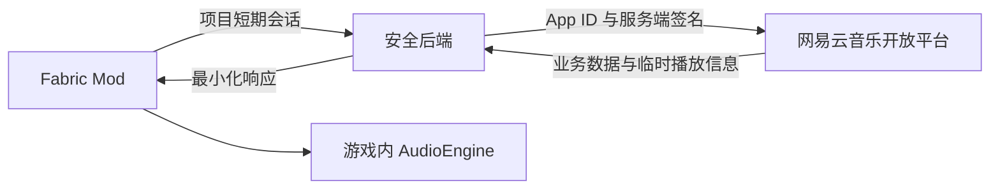
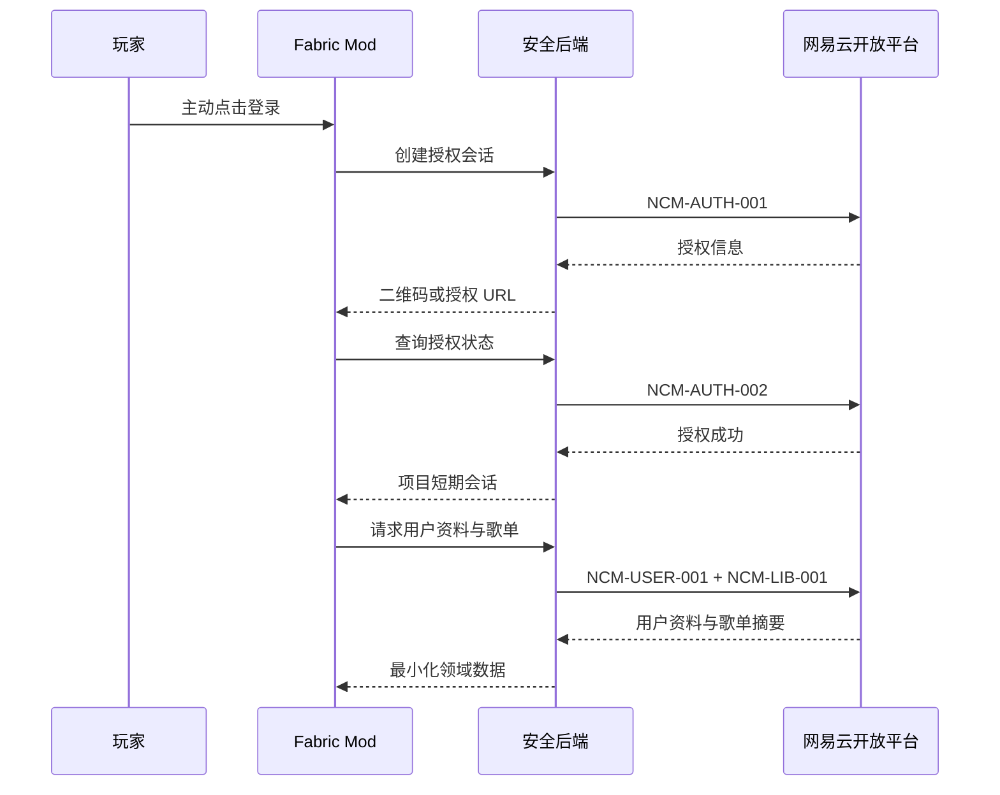
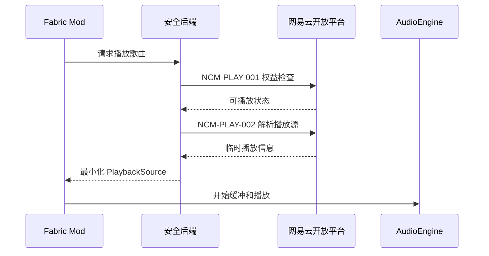

# 网易云音乐 API 接口调用需求文档

> 文档版本：v0.1.0  
> 文档状态：接口能力清单，待开放平台文档逐项核实  
> 创建时间：2026-08-18  
> 适用项目：Minecraft Fabric 音乐体验 Mod（Cubic Cadence / 方律）  
> 首期平台：网易云音乐

## 1. 文档目的

本文档用于明确 Minecraft Fabric 音乐体验 Mod 在 MVP 阶段需要调用的网易云音乐开放平台 API 能力，作为以下工作的输入：

- 开放平台应用申请与 Scope 核对；
- 网易云 `MusicProvider` 实现；
- 用户授权和令牌生命周期设计；
- 安全后端接口设计；
- 歌单、搜索和播放功能开发；
- 接口联调、异常处理与发布验收。

本文档当前描述的是“项目需要的平台能力”，不将尚未核实的接口名称、URL、请求方法或字段写成官方事实。获得审核后可见的网易云开放平台文档后，必须把本文档中的“待官方确认”项替换为真实接口信息。

## 2. 范围与优先级

### 2.1 优先级定义

| 优先级 | 含义 |
| --- | --- |
| P0 | MVP 必须具备，缺失时无法形成登录、浏览和播放闭环 |
| P1 | MVP 可降级，但会影响体验完整性 |
| P2 | 第二阶段或长期功能，不阻塞首版发布 |

### 2.2 当前核实状态

| 状态 | 含义 |
| --- | --- |
| 待官方确认 | 根据产品需求确定需要该能力，但尚未核实正式接口 |
| 已确认 | 已从当前有效的网易云开放平台文档核实并记录证据 |
| 不可用 | 当前应用类型或 Scope 不允许调用 |
| 替代实现 | 无独立接口，通过其他正式接口或返回字段实现 |

当前所有接口能力默认状态为“待官方确认”。正式编码前不得根据非官方逆向接口补全端点。

## 3. 调用架构与安全边界

### 3.1 推荐调用链路

### 3.2 边界要求

- 开发者 Private Key 只能保存在受控后端或本机安全开发环境中；
- Private Key 不得进入 Mod 源码、客户端配置、日志、JAR 或公开仓库；
- 普通玩家只完成网易云账号授权，不应被要求申请开发者账号；
- 用户 Access Token 和 Refresh Token 的实际保存位置必须根据官方授权模型确定；
- Mod 只接收完成功能所需的最小字段；
- 临时播放地址只在播放期间使用，默认不持久化；
- 所有网络调用均在后台线程执行，不阻塞 Minecraft 渲染线程；
- 平台返回不可播放时必须停止播放流程，不得尝试绕过限制。

## 4. P0 接口能力总览

| 编号 | 接口能力 | 使用场景 | 建议调用方 | 状态 |
| --- | --- | --- | --- | --- |
| NCM-AUTH-001 | 创建用户授权会话 | 玩家首次登录或重新授权 | 安全后端 | 待官方确认 |
| NCM-AUTH-002 | 查询或接收授权结果 | 二维码轮询或浏览器回调 | 安全后端 | 待官方确认 |
| NCM-AUTH-003 | 刷新用户授权令牌 | Token 临近过期 | 安全后端 | 待官方确认 |
| NCM-AUTH-004 | 校验当前授权状态 | 游戏启动恢复登录 | 安全后端 | 待官方确认 |
| NCM-AUTH-005 | 撤销授权或退出登录 | 玩家主动退出账号 | 安全后端 | 待官方确认 |
| NCM-USER-001 | 获取当前用户资料 | 显示昵称、头像和账号标识 | 安全后端 | 待官方确认 |
| NCM-LIB-001 | 获取用户歌单摘要 | 创建歌单、收藏歌单列表 | 安全后端 | 待官方确认 |
| NCM-LIB-002 | 获取红心歌曲集合 | 展示喜欢的音乐 | 安全后端 | 待官方确认 |
| NCM-LIB-003 | 获取歌单详情 | 展示歌单资料 | 安全后端 | 待官方确认 |
| NCM-LIB-004 | 分页获取歌单歌曲 | 打开歌单并懒加载歌曲 | 安全后端 | 待官方确认 |
| NCM-SEARCH-001 | 搜索歌曲 | 搜索并播放单曲 | 安全后端 | 待官方确认 |
| NCM-SEARCH-002 | 搜索歌单 | 搜索并打开歌单 | 安全后端 | 待官方确认 |
| NCM-SEARCH-003 | 搜索专辑 | 搜索并打开专辑 | 安全后端 | 待官方确认 |
| NCM-TRACK-001 | 批量获取歌曲详情 | 补全歌曲元数据和队列 | 安全后端 | 待官方确认 |
| NCM-ALBUM-001 | 获取专辑详情与歌曲 | 打开专辑搜索结果 | 安全后端 | 待官方确认 |
| NCM-PLAY-001 | 判断歌曲权益与可播放性 | 播放前检查版权、会员和地区限制 | 安全后端 | 待官方确认 |
| NCM-PLAY-002 | 解析临时播放源 | 获取当前有效的音频播放信息 | 安全后端 | 待官方确认 |

## 5. 用户授权与会话接口

### 5.1 NCM-AUTH-001 创建用户授权会话

用途：在玩家主动打开登录页面后，创建二维码授权或浏览器授权会话。

需要确认：

- 官方支持的授权模式；
- 应用类型是否允许 Minecraft 客户端使用；
- 所需 Scope；
- 二维码内容、授权 URL、会话标识和过期时间；
- 是否需要回调地址以及回调地址审核规则；
- 是否允许后端代客户端完成令牌交换。

Mod 最小响应字段：

| 内部字段 | 说明 |
| --- | --- |
| `authorizationId` | 项目内部授权会话标识 |
| `authorizationUrl` | 浏览器授权地址，可为空 |
| `qrCodeContent` | 用于生成二维码的内容，可为空 |
| `expiresAtEpochMs` | 授权会话过期时间 |
| `pollIntervalMs` | 建议轮询间隔，可为空 |

### 5.2 NCM-AUTH-002 查询或接收授权结果

用途：查询扫码状态，或由后端接收官方授权回调。

必须覆盖的状态：

- 等待扫码；
- 已扫码、等待确认；
- 授权成功；
- 用户拒绝；
- 二维码过期；
- 应用无权限；
- 网络或平台异常。

令牌不得直接输出到客户端日志。若官方返回一次性授权码，应由后端完成后续交换。

### 5.3 NCM-AUTH-003 刷新用户授权令牌

用途：在 Access Token 临近过期时刷新会话。

需要确认：

- Access Token 与 Refresh Token 有效期；
- 是否支持刷新令牌轮换；
- 刷新后的旧令牌失效规则；
- 刷新失败后是否必须重新授权；
- 是否存在刷新频率限制。

客户端只能自动刷新一次，失败后保留非敏感缓存并提示重新登录，禁止形成刷新循环。

### 5.4 NCM-AUTH-004 校验当前授权状态

用途：游戏重启时判断项目会话对应的网易云授权是否仍有效。

如果平台没有独立校验接口，可使用最小权限的当前用户资料接口作为替代，但必须记录为“替代实现”。

### 5.5 NCM-AUTH-005 撤销授权或退出登录

用途：玩家主动退出账号时撤销平台授权或清除服务端会话。

退出后必须：

- 删除客户端会话和安全令牌引用；
- 删除或隔离该账号的私人缓存；
- 终止正在进行的同步和播放源解析；
- 停止当前播放并释放音频资源；
- 不影响 Minecraft 本身继续运行。

## 6. 用户资料与音乐库接口

### 6.1 NCM-USER-001 获取当前用户资料

最小字段需求：

| 领域字段 | 含义 | 是否必需 |
| --- | --- | --- |
| `providerId` | 固定为网易云 Provider 标识 | 是 |
| `userId` | 平台用户标识 | 是 |
| `displayName` | 昵称 | 是 |
| `avatarUrl` | 头像地址 | 否 |

不得因头像加载失败判定登录失败。日志中的用户 ID 应截断或哈希。

### 6.2 NCM-LIB-001 获取用户歌单摘要

能力要求：

- 返回用户创建的歌单；
- 返回用户收藏的歌单；
- 能区分创建、收藏和平台特殊集合；
- 支持分页或明确最大返回数量；
- 提供更新时间，用于缓存刷新判断。

最小字段需求：

| 领域字段 | 含义 |
| --- | --- |
| `playlistId` | 歌单标识 |
| `name` | 歌单名称 |
| `coverUrl` | 封面缩略图地址 |
| `trackCount` | 歌曲数量 |
| `ownership` | 创建、收藏或特殊集合 |
| `updatedAt` | 平台最后更新时间，可为空 |

### 6.3 NCM-LIB-002 获取红心歌曲集合

需要确认红心歌曲在开放平台中的表达方式：

- 独立接口；
- 特殊歌单；
- 收藏关系分页接口；
- 当前应用类型不可用。

如果红心歌曲只是特殊歌单，应复用歌单歌曲分页能力，不重复实现新的数据链路。

### 6.4 NCM-LIB-003 获取歌单详情

最小字段包括歌单 ID、名称、封面、描述、创建者、歌曲数量、更新时间及访问权限。私人或已删除歌单必须映射为明确错误，不能显示成空歌单。

### 6.5 NCM-LIB-004 分页获取歌单歌曲

必须确认：

- 页码/游标规则；
- 单页最大数量；
- 排序是否稳定；
- 歌单更新时游标是否失效；
- 是否直接返回完整歌曲元数据；
- 是否需要再调用歌曲详情接口补全字段。

缓存只保存歌曲元数据，不保存完整音频文件。

## 7. 搜索、歌曲与专辑接口

### 7.1 NCM-SEARCH-001 至 NCM-SEARCH-003 搜索

MVP 支持歌曲、歌单和专辑三类搜索。需要确认统一搜索接口是否通过类型参数区分，或需要分别调用不同接口。

共同要求：

- 关键词非空并设置最大长度；
- 输入防抖；
- 支持分页；
- 返回总数或下一页标识；
- 搜索结果携带可用于详情查询的稳定标识；
- 超限时停止继续请求并显示明确提示。

### 7.2 NCM-TRACK-001 批量获取歌曲详情

最小字段需求：

| 领域字段 | 含义 |
| --- | --- |
| `providerId` | 平台标识 |
| `trackId` | API 请求使用的歌曲标识 |
| `originalTrackId` | 网页或客户端唤起使用的原始标识，如官方存在该区分 |
| `title` | 歌曲名称 |
| `artists` | 歌手列表 |
| `albumId` | 专辑标识 |
| `albumName` | 专辑名称 |
| `coverUrl` | 封面地址 |
| `durationMs` | 时长 |
| `availability` | 当前可用性 |

官方 CLI 资料区分 API 请求使用的加密 ID、客户端链接使用的原始 ID，并要求依据 `visible` 判断歌曲是否可播放。正式字段映射必须以开放平台文档为准，但领域模型需要能够同时保存这两类标识，不能假设一个 `trackId` 可覆盖全部用途。

### 7.3 NCM-ALBUM-001 获取专辑详情与歌曲

用途：打开专辑搜索结果。若 MVP 只展示专辑名称但不允许进入详情，可将该能力降为 P1；一旦允许打开专辑并播放其中歌曲，则属于 P0。

## 8. 播放权益与播放源接口

### 8.1 NCM-PLAY-001 判断歌曲权益与可播放性

播放前必须识别：

- 可以播放；
- 歌曲下架或不可见；
- 需要会员；
- 地区受限；
- 当前音质不可用；
- 当前应用无播放权限；
- 其他版权限制。

如果歌曲详情或播放源接口已经返回完整权益字段，可作为替代实现，但 UI 必须得到结构化的不可播放原因。

建议内部映射：

| 平台结果 | `MusicErrorCode` |
| --- | --- |
| 未登录或授权缺失 | `AUTH_REQUIRED` |
| 授权过期 | `AUTH_EXPIRED` |
| 请求频率或总量超限 | `RATE_LIMITED` |
| 歌曲不可用 | `TRACK_UNAVAILABLE` |
| 需要会员 | `MEMBERSHIP_REQUIRED` |
| 地区受限 | `REGION_RESTRICTED` |
| 未识别限制 | `UNKNOWN` |

### 8.2 NCM-PLAY-002 解析临时播放源

最小字段需求：

| 领域字段 | 含义 |
| --- | --- |
| `uri` | 当前有效的音频资源地址 |
| `contentType` | 音频 MIME 类型或格式提示 |
| `expiresAtEpochMs` | 地址过期时间 |
| `requestHeaders` | 播放请求必须附带的非机密请求头 |
| `quality` | 实际返回音质 |
| `bitrate` | 实际码率，可为空 |

处理规则：

1. 只在玩家实际播放时解析；
2. 播放地址不写入持久缓存和普通日志；
3. 地址过期时最多重新解析一次；
4. 请求音质不可用时，只能按照官方允许的规则降级；
5. 不得绕过会员、版权、地区或应用权限限制；
6. 获取的音频由 Mod 自己的 `AudioEngine` 解码和输出，不依赖外部 CLI 播放器。

## 9. P1 与 P2 接口

| 编号 | 能力 | 优先级 | 说明 |
| --- | --- | --- | --- |
| NCM-LYRIC-001 | 获取歌词 | P1 | 第二阶段实现逐行歌词和 HUD 高亮 |
| NCM-REC-001 | 获取每日推荐歌曲 | P2 | 不阻塞个人歌单闭环 |
| NCM-REC-002 | 获取每日推荐歌单 | P2 | 需额外确认推荐 Scope |
| NCM-FAV-001 | 收藏或取消收藏歌曲 | P2 | 涉及写操作和额外权限 |
| NCM-PL-001 | 创建歌单 | P2 | 涉及平台数据写入 |
| NCM-PL-002 | 添加或删除歌单歌曲 | P2 | 需要并发与失败回滚设计 |
| NCM-HISTORY-001 | 获取播放历史 | P2 | 需确认隐私和数据范围 |

## 10. 明确不调用的能力

MVP 不申请或调用以下能力：

- 账号密码登录；
- 绕过会员、版权、音质或地区限制；
- 下载或永久保存完整歌曲；
- 云盘文件上传；
- 播客创建、编辑和单集上传；
- 笔记发布或管理；
- 批量修改用户音乐资产；
- 与游戏音乐体验无关的开放平台能力。

采用最小权限原则，避免为了未来可能使用的功能提前申请 Scope。

## 11. 与项目模块的映射

| 项目模块或方法 | 对应接口能力 |
| --- | --- |
| `AuthManager.beginLogin()` | NCM-AUTH-001、NCM-AUTH-002 |
| `AuthManager.refresh()` | NCM-AUTH-003 |
| `AuthManager.restoreSession()` | NCM-AUTH-004 |
| `MusicProvider.logout()` | NCM-AUTH-005 |
| `MusicProvider.getCurrentUser()` | NCM-USER-001 |
| `MusicProvider.getUserPlaylists()` | NCM-LIB-001、NCM-LIB-002 |
| `MusicProvider.getPlaylistTracks()` | NCM-LIB-003、NCM-LIB-004、NCM-TRACK-001 |
| `MusicProvider.search()` | NCM-SEARCH-001 至 NCM-SEARCH-003 |
| `MusicProvider.resolvePlaybackSource()` | NCM-PLAY-001、NCM-PLAY-002 |
| `MusicProvider.getLyrics()` | NCM-LYRIC-001，第二阶段 |

## 12. 主要调用流程

### 12.1 登录与音乐库加载

### 12.2 歌曲播放

## 13. 缓存与失效策略

| 数据 | 建议缓存 | 失效策略 |
| --- | --- | --- |
| 用户资料 | 是 | 后台刷新或退出登录时删除 |
| 歌单摘要 | 是 | 缓存优先，后台刷新 |
| 歌单歌曲元数据 | 是 | 打开时按页刷新 |
| 搜索结果 | 短期可选 | 会话级或短 TTL |
| 封面缩略图 | 是 | LRU 与大小上限 |
| Access Token | 安全保存 | 按官方有效期刷新 |
| Refresh Token | 安全保存 | 按官方轮换规则处理 |
| 临时播放地址 | 否 | 仅内存短期使用 |
| 完整音频文件 | 否 | 禁止永久缓存 |

## 14. 开放平台逐项核验表

获得正式文档后，每个 P0 能力必须补全以下内容：

| 核验项 | 要求 |
| --- | --- |
| 官方接口名称 | 使用开放平台当前名称 |
| 文档 ID 或链接 | 记录可追溯的官方来源 |
| HTTP 方法与路径 | 不使用猜测或逆向端点 |
| 鉴权方式 | App 签名、用户 Token 或两者 |
| 所需 Scope | 记录申请状态和审核条件 |
| 请求字段 | 类型、必填性、长度和枚举 |
| 响应字段 | 与内部领域模型逐项映射 |
| 分页规则 | 页码、游标、上限和排序 |
| 错误码 | 转换为统一 `MusicErrorCode` |
| 限流规则 | 每秒、每日、并发或总量限制 |
| 数据保留 | 哪些字段允许缓存及保留周期 |
| 发布限制 | 是否允许公开分发给普通玩家 |
| 验证证据 | 脱敏请求、响应摘要和验证日期 |

## 15. 编码前阻塞项

以下阻塞项在未通过网易云开放平台官方文档核实前，不进入对应接口的完整业务编码；已确定的项目级结论已在状态列标注。

| # | 阻塞项 | 状态 |
| --- | --- | --- |
| 1 | 正式用户授权方式和 Scope | 待官方核实 |
| 2 | 普通玩家是否无需开发者账号即可授权 | 待官方核实 |
| 3 | 创建歌单、收藏歌单和红心歌曲是否均可读取 | 待官方核实 |
| 4 | 搜索接口是否支持歌曲、歌单和专辑 | 待官方核实 |
| 5 | 歌曲 ID 的加密标识、原始标识和使用边界 | 待官方核实 |
| 6 | 可播放性、会员和地区限制的正式字段 | 待官方核实 |
| 7 | 是否允许返回可由第三方播放器读取的临时音频源 | 待官方核实 |
| 8 | 音频格式、音质、请求头和地址有效期 | 音频格式与音质均有（已确定）；请求头与地址有效期待官方核实 |
| 9 | Private Key 签名和安全后端要求 | 需要独立后端（已确定）；Private Key 签名方式待官方核实 |
| 10 | 调用额度、并发、限流和公开发布限制 | 每日调用 5000 次（用户确认）；并发与限流细节待官方核实 |

## 16. 阶段 0 验收标准

API 能力验证只有同时满足以下条件才算完成：

- 每个 P0 能力都找到正式接口或记录明确的不可用结论；
- 所有接口都记录鉴权、Scope、请求和响应字段；
- 完成一次不含敏感信息的登录验证记录；
- 完成用户资料、歌单、搜索和歌曲详情验证；
- 完成至少一种允许播放歌曲的播放源验证；
- 完成不可播放、会员或其他受限歌曲的错误验证；
- 明确 Private Key、用户 Token 和临时播放地址的存储边界；
- 明确公开发布是否需要独立安全后端；
- 根据真实字段更新 `MusicProvider` 和领域模型设计；
- 文档中不存在未标注来源的推测性正式接口。

## 17. 参考资料

- [网易云音乐开放平台](https://developer.music.163.com/)
- [网易云音乐 CLI npm 包](https://www.npmjs.com/package/%40music163/ncm-cli)
- [网易云音乐官方 Agent Skills](https://github.com/NetEase/skills)
- [Minecraft Fabric 音乐体验 Mod 开发文档](./minecraft-fabric-music-mod-development-document.md)
